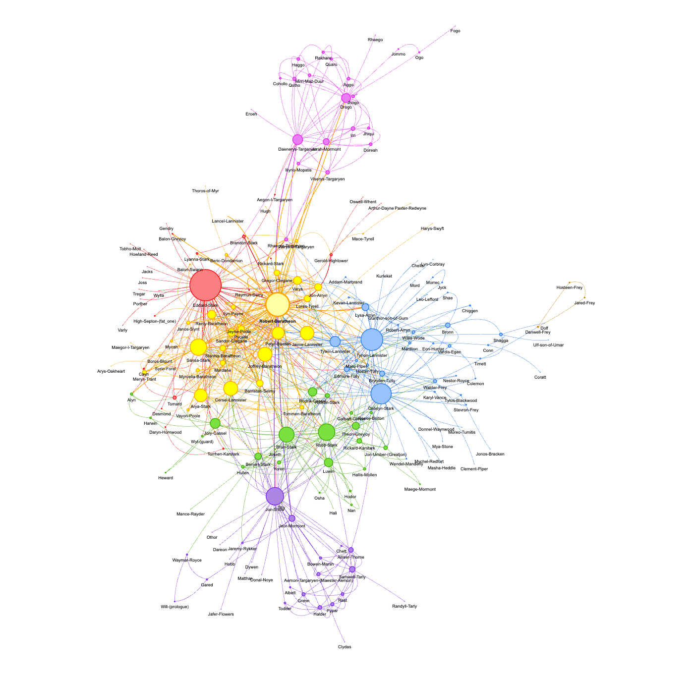
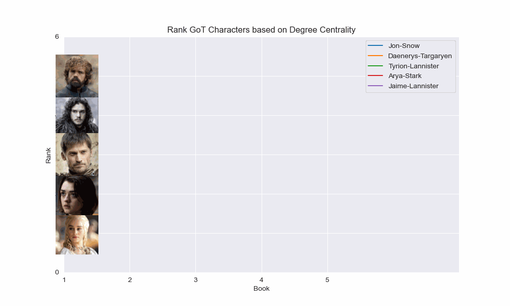

# GoT Character relevance evolution

This project aims to analyze the relationships between characters in the Game of Thrones book series 
using network analysis.  The code reads data from CSV files, creates network graphs, and calculates 
the degree of centrality for each character in the network. It then visualizes the network using different 
layouts and libraries, such as NetworkX and Pyvis. The project also explores community detection and 
centrality measures, including eigenvector centrality, closeness centrality, and betweenness centrality.

Pyvis Network Graph with communities:

Rank GoT Characters based on Degree Centrality:

